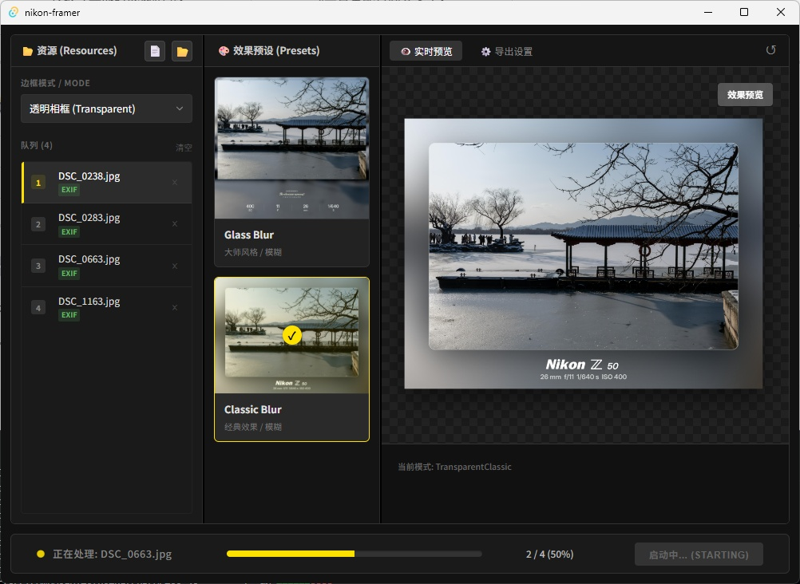

# Nikon Framer v2.0 📷

**Nikon Framer v2.0** 是一次里程碑式的升级。作为专为尼康摄影师打造的本地水印相框工具，v2.0 彻底重构了底层处理管线，引入了多核并行计算与全新的交互式预览体验。

结合 **Rust (Rayon)** 的极致算力与 **Vue 3** 的灵动交互，它能充分榨干您电脑的每一颗 CPU 核心，实现海量 RAW/JPG 图片的毫秒级处理，同时坚守 100% 本地运行的隐私承诺。

---

## 🔥 v2.0 新特性 (New in v2.0)

### 🚀 性能觉醒：多核并行处理 (Parallel Processing)

告别单线程排队！v2.0 引入了 **Rayon** 数据并行库，将底层的图像处理管线升级为**真·多线程架构**。

* **火力全开**: 自动识别 CPU 核心数，将任务分发至所有线程并行执行。
* **极速体验**: 相比 v1.0，大批量图片处理速度提升 **500% - 1000%**（取决于核心数）。
* **无序写入**: 配合原子计数器 (`AtomicUsize`)，实现非阻塞的进度追踪，谁先跑完谁先存。

### 👁️ 交互式实时预览 (Interactive Preview)

不再“盲人摸象”，预览现在所见即所得。

* **沉浸式操作**: 支持滚轮**无损缩放**、左键**自由拖拽**，并在切换图片时自动复位。
* **Base64 极速渲染**: 预览流采用内存直出 Base64 缩略图，规避了本地文件锁与 CSP 限制，加载零延迟。
* **智能状态切换**: 自动识别“预设图”与“已生成结果图”，批处理完成后自动刷新预览，呈现最终效果。

### 🧠 智能批处理引擎 (Smart Batch Engine)

* **智能去重 (Smart Skip)**: 启动任务前自动扫描硬盘，毫秒级过滤已存在的文件。进度条只显示“真正需要处理”的数量，拒绝重复劳动。
* **优雅终止**: 即使在 100 个线程全速运转时，也能通过原子标记 (`AtomicBool`) 安全、瞬间地响应“停止”指令。
* **稳健的资源管理**: 修复了 Vite 静态资源打包问题 (`import.meta.glob`)，确保打包后所有预设素材依然完美加载。

---

## ✨ 核心功能 (Core Features)

### 🎨 影廊级美学

* **高斯模糊 (Atmosphere)**: 智能提取画面主色调生成模糊背景，辅以磨砂玻璃质感，营造高端氛围。
* **极简白底 (Classic)**: 经典的画廊风格白边，专注于影像本身的纯粹。
* **完美排版**: 专为 Nikon Z 系列优化的 Logo 布局，自动解析相机型号（Z8/Zf/Z6III）与镜头参数。

### 🛡️ 安全与隐私

* **隐私优先**: 纯本地运行，断网可用，您的照片数据永远不会上传云端。
* **防误触机制**: 启动时的倒计时保护与二次确认逻辑。
* **异常熔断**: 单张图片处理失败不会阻塞队列，自动记录错误日志并继续执行。

### 🎨 支持的相框风格 (Frame Styles)

Nikon Framer 内置了多种精心调校的影廊级模版，满足不同场景的展示需求。

| **极简白底 (Classic White)** | **简约透明 (Classic Transparent)** |
| :---: | :---: |
|  |  |
| **经典白底风格**<br>底部留白展示 EXIF 信息，简约而不简单，<br>完美还原摄影展的观赏体验。 | **沉浸式氛围感**<br>智能提取画面主色调生成毛玻璃背景，<br>辅以弥散投影，让主体呼之欲出。 |

| **宝丽来风格 (Polaroid)** | **大师透明风格 (Master Transparent)** |
| :---: | :---: |
|  |  |
| **复古胶片感**<br>致敬经典即时成像相纸，<br>通过更宽的下边距营造独特的文艺气息。 | **极致深邃**<br>模糊背景配合高亮文字，<br>在暗色模式下提供最佳的视觉对比度。 |

---

## 📸 效果演示 (Demo)

| **交互式预览 (Interactive)** |
| --- |
|  |

---

## 🛠️ 技术架构 (Architecture)

本项目采用 **Clean Architecture** 指导下的现代化混合架构，实现了前后端分离与极致性能的平衡。

### Frontend (User Interface)

* **Core**: Vue.js 3 (Composition API) + Vite
* **State**: Vue Reactivity (Store 模式)，实现跨组件状态共享。
* **Interaction**: CSS `transform` 矩阵变换实现高性能图片缩放与拖拽。
* **IPC Bridge**: 封装 `invoke` 与 `listen`，通过 Event Loop 处理 Rust 发来的高频进度事件。

### Backend (Rust Core)

* **Framework**: Tauri v2.0 (IPC & Window Management)
* **Parallelism**: `rayon` (Work-stealing parallelism) + `std::sync::Arc` (线程安全共享)。
* **State Mgmt**: `AtomicUsize` / `AtomicBool` 实现无锁状态同步。
* **Imaging**: `image-rs` 处理图像编解码，`kamadak-exif` 解析元数据。
* **Assets**: 动态 Base64 转换策略，解决 Webview 文件权限与缓存问题。

---

## 🚀 快速开始 (Getting Started)

### 环境要求

* Node.js (LTS)
* Rust (Latest Stable)

### 1. 克隆项目

```bash
git clone https://github.com/Aurora0201/nikon-framer.git
cd nikon-framer

```

### 2. 安装依赖

```bash
npm install

```

### 3. 开发模式运行

启动前端热重载与 Rust 后端（注意：Debug 模式下图像处理速度较慢）：

```bash
npm run tauri dev

```

### 4. 生产环境构建

构建极致性能的 Release 版本（自动启用 Rust 编译器最高级别优化）：

```bash
npm run tauri build

```

*构建产物位于 `src-tauri/target/release/bundle*`

---

## 📝 开发计划 (Roadmap)

* [x] **v2.0: 多线程并行处理 (Multi-threading)** ✅
* [x] **v2.0: 交互式预览 (Zoom/Pan)** ✅
* [x] **v2.0: 智能去重与跳过 (Smart Skip)** ✅
* [ ] 更多品牌支持: Sony (Alpha), Canon (EOS), Fujifilm (X-Series)
* [ ] 自定义模版: 允许用户导入 JSON 配置自定义边框布局
* [ ] 水印签名: 支持导入 SVG/PNG 个人签名

---

## 📄 许可证 (License)

[MIT License](https://www.google.com/search?q=LICENSE) © 2025 Aurora0201