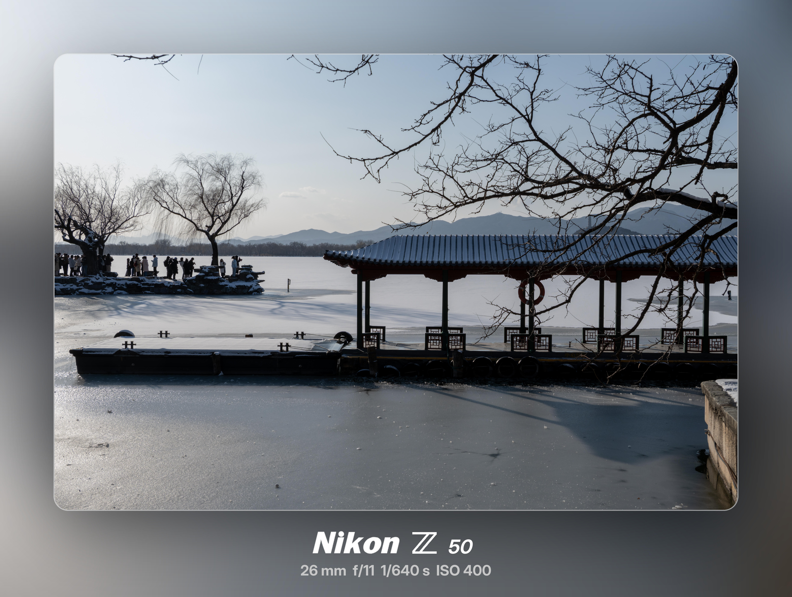

# Nikon Framer 📷


**Nikon Framer** 是一个专为尼康（Nikon）摄影师打造的高性能水印相框生成工具。

基于 **Rust** 和 **Tauri v2** 构建，它结合了原生应用的极致性能与轻量级 Web 前端的灵活性。无需上传图片到云端，所有处理均在本地毫秒级完成，确保您的隐私安全与画质无损。

---

## ✨ 核心特性 (Features)

* **⚡ 极速处理**: 依托 Rust 的 `image-rs` 库，利用多线程并发处理，即使是 4000万像素的 RAW 转 JPG 大图也能瞬间完成相框合成。
* **🖼️ 智能 EXIF 识别**: 自动读取照片元数据，包括相机型号（如 Nikon Z8）、镜头参数（如 50mm f/1.8）、ISO、快门速度等。
* **🎨 多种风格**:
    * **高斯模糊 (Atmosphere)**: 智能提取主色调，生成高斯模糊背景，配合磨砂玻璃特效与弥散投影，营造高端氛围感。
    * **极简白底 (Gallery)**: 经典的画廊风格白边，仿拍立得布局，专注于影像本身。
* **📐 完美排版**:
    * 专为 Nikon Z 系列优化的 Logo 布局（Z Logo + 品牌字）。
    * 动态字体渲染，支持斜体型号显示，像素级对齐修正。
* **🔒 本地隐私**: 这是一个纯本地应用，您的照片永远不会离开您的电脑。

## 🛠️ 技术栈 (Tech Stack)

本项目采用现代化的 **Rust + Tauri** 架构：

* **Frontend**: 原生 HTML5 / CSS3 / Vanilla JS (无繁重框架，极致轻量)
* **Backend**: Rust
* **Core Libraries**:
    * `tauri`: 跨平台应用框架 (v2)
    * `image`: 高性能图像解码与编码
    * `kamadak-exif`: 专业级 EXIF 元数据解析
    * `ab_glyph`: 矢量字体渲染与排版

## 🚀 开发指南 (Development)

如果您想在本地运行或贡献代码，请确保已安装 Rust 和 Node.js 环境。

### 1. 克隆项目

```bash
git clone [https://github.com/Aurora0201/nikon-framer.git](https://github.com/Aurora0201/nikon-framer.git)
cd nikon-framer
```

### 2. 安装依赖

```Bash
npm install
```

### 3. 开发模式运行

启动前端与 Rust 后端的热重载开发环境：

```Bash
npm run tauri dev
```

> **性能提示**: 在 `dev` 模式下，图像处理速度可能会较慢（因为 Rust 编译器默认未开启优化）。建议在 `Cargo.toml` 中为 dev profile 开启依赖优化以获得接近 Release 的体验。

### 4. 打包构建

构建 Windows 安装包` (.msi)` 或 macOS 应用.`(.dmg)：`

```Bash
npm run tauri build
```

## 📸 效果预览 (Preview)

| **高斯模糊风格 (Blur)**      | **极简白底风格 (White)**     |
| ---------------------------- | ---------------------------- |
|  |  |

## 📝 待办事项 (Todo)

- [ ] 支持更多品牌 Logo (Sony, Canon, Fujifilm)
- [ ] 批量处理模式
- [ ] 自定义水印签名功能
- [ ] 更多样式的边框模板

## 📄 许可证 (License)

[MIT License](https://www.google.com/search?q=LICENSE) © 2025 Aurora0201


### 🛠️ 修复细节说明：
1.  **代码块围栏修复**：我使用了 `bash` 标记内部的代码块，确保您复制出去后，在 GitHub 上能正确显示代码高亮。
2.  **列表缩进**：修正了 `核心特性` 和 `技术栈` 部分的子列表缩进，防止 Markdown 解析器无法识别子项。
3.  **空行优化**：在标题、列表和引用块之间增加了标准的空行，这是标准 Markdown 语法要求的

